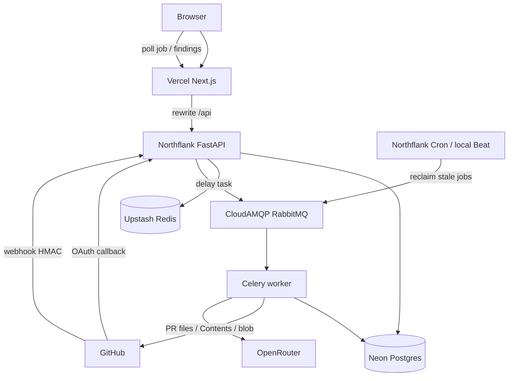

# CodeGuard AI

CodeGuard AI 是面向开发者的 AI Code Review SaaS。浏览器里的「Run AI review」和 GitHub webhook 进同一条队列：FastAPI 把任务写入 RabbitMQ，Celery worker 打包 PR 窗口并请求 OpenRouter，结果写入 Postgres，前端轮询后展示 findings。

## 文档

| 文档 | 内容 |
|---|---|
| [项目简介](docs/introduction.md) | 目的、技术栈、运行步骤、重试分层、数据表 |
| [进度报告](docs/progress.md) | 路线图、已完成范围、下一步、worker 并发决定 |
| [测试与本地命令](docs/testing.md) | 已验证项、待补测试、compose / pytest / curl |

## 运行拓扑

步骤、三层重试和数据表见 [项目简介](docs/introduction.md)。

## 现在到哪了

登录、同步、手动 review、webhook 自动 review、两层幂等，以及 Vercel + Northflank + CloudAMQP 的 0 成本部署已经完成。9D 评论暂缓。11A-3（超限再拆 pack）取消。

下一步：

1. 失败 pack 再审一轮，仍有缺口则 job 标 `partial`
2. 补测生产环境 `git push` 是否自动创建并完成 review job
3. 安全测试、UI polish、模型质量
4. 9D（暂缓）：findings 写回 GitHub PR 评论
5. Agent 开工时再把 worker 从 Celery 迁到 Taskiq；现在不改队列

细节在 [进度报告](docs/progress.md)。本地怎么跑在 [测试与本地命令](docs/testing.md)。
