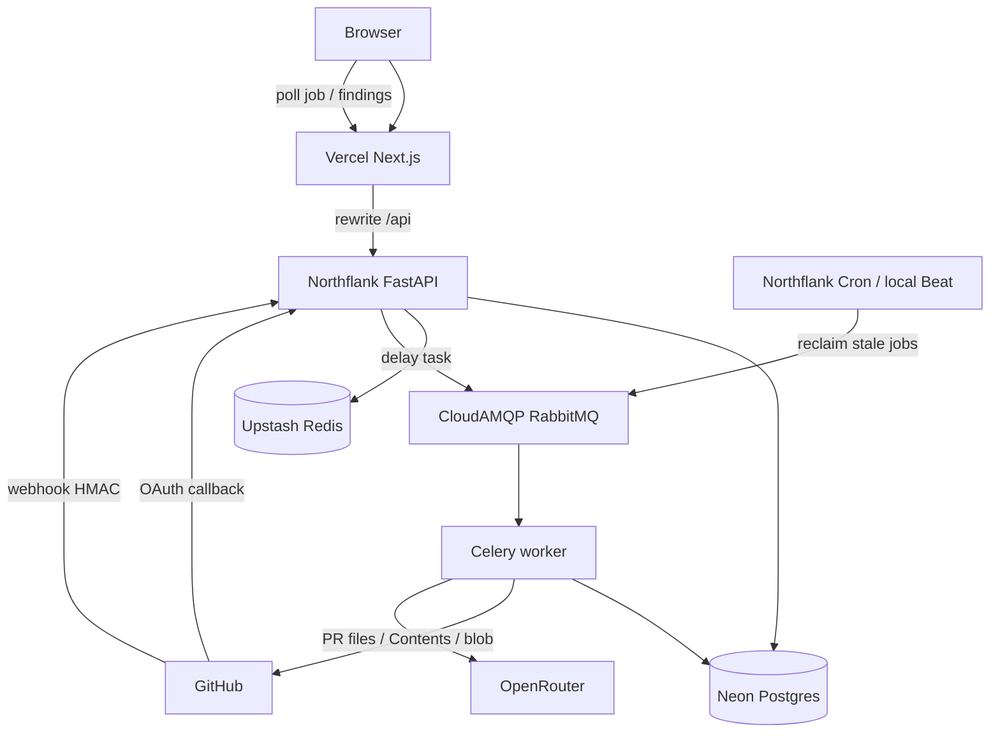

# CodeGuard AI

CodeGuard AI 是面向开发者的 AI Code Review SaaS。浏览器里的「Run AI review」和 GitHub webhook 进同一条队列：FastAPI 把任务写入 RabbitMQ，Celery worker 打包 PR 窗口并请求 OpenRouter，结果写入 Postgres，前端轮询后展示 findings。

## 文档

| 文档 | 内容 |
|---|---|
| [项目简介](docs/introduction.md) | 目的、技术栈、运行步骤、重试分层、数据表 |
| [进度报告](docs/progress.md) | 路线图、已完成范围、下一步、worker 并发决定 |
| [测试与本地命令](docs/testing.md) | 后端 / 前端自动化测试清单、compose / pytest / npm test / curl |

## 运行拓扑

步骤、三层重试和数据表见 [项目简介](docs/introduction.md)。

## 测试

自动化用例不访问 GitHub、OpenRouter 或数据库。命令和逐项说明在 [测试与本地命令](docs/testing.md)。当前一共 **122** 个后端用例、**30** 个前端用例。

## Backend tests

`cd backend && pytest -q`

- **打包与窗口**（`test_diff_chunking.py`、`test_diff_chunking_edges.py`）：噪声过滤、每个该审文件入 pack、超大文件续包、hunk 上下文、无 patch 仍覆盖、超长行拆分、预算 `max_chars × 0.8`（下限 1）、删除 hunk、窗口合并、已删除文件用 patch、无 patch 且无源码记为缺口、pack 前言保留 `file_path`。
- **GitHub 文件正文与分页**（`test_github_pr_files.py`、`test_github_fetch_and_pagination.py`）：raw 200，403/404 回退 blob，base64 / utf-8 / 空 body / 非法 JSON；Contents 500 不回退；仓库和 PR 列表跟随 `Link` next；PR files 只取第一页。
- **同步落库**（`test_sync_services.py`）：仓库与 PR 的 upsert，以及 `replace_missing` 时删除缺失行；webhook 同步不删其他 PR；文件同步只 upsert，不删除 GitHub 已不再列出的文件。
- **Review 执行**（`test_review_execution.py`、`test_review_job_idempotency.py`、`test_review_models.py`、`test_review_http_retries.py`）：小 PR / 大 PR、部分 pack 失败仍 `completed`、全部失败则 `failed`、去重与 `file_path` 补齐、active job 复用、白名单模型；429/500 的 HTTP 重试（间隔 35 秒），超时和 soft limit 不重试。
- **任务重试与回收**（`test_review_job_task.py`、`test_review_reclaim_and_retries.py`）：soft timeout 先整单重试再标失败、瞬时错误耗尽后失败、非瞬时错误不重试、countdown 翻倍封顶、reclaim 只更新查询到的过期 `processing` 行。
- **登录、OAuth、Webhook**（`test_http_api.py`、`test_oauth_openrouter_and_pipeline.py`、`test_webhook_idempotency.py`）：JWT 与 cookie、GitHub callback、delivery 幂等、签名与 `ping` / `opened` / `closed`、自动 review 流水线（未知仓库、缺 token、复用 active job、按本地仓库入队）。
- **HTTP 同步与 review、归属、限流、健康检查**（`test_http_api.py`、`test_ownership_health_and_limits.py`、`test_rate_limit.py`、`test_production_baseline.py`）：同步与 review 的 400/404/202/503/422、查询绑定 `user_id`、限流分桶与 Redis 故障时 fail closed、生产配置校验、liveness / readiness。
- **OpenRouter 解析**（`test_oauth_openrouter_and_pipeline.py`）：围栏 JSON、严重级别别名、行号、空 content 与非法 findings。

## Frontend tests

`cd frontend && npm test`（Vitest，jsdom，无浏览器 E2E）

- **Job 钉选与 latest（Option A）**（`lib-behavior.test.ts`、`job-pin-and-sync-cache.test.tsx`）：非空 `jobId` 为历史钉选；默认最新 `completed`，否则最新一条；切 tab 与回到 latest 时去掉钉选；无效 `jobId` 显示 not found，不展示其他 job 的 findings；文件页不借用别的 job；Run AI review 入队并清掉历史钉选。
- **Findings、状态与 diff**（`lib-behavior.test.ts`）：按文件 id 再按 path 定位，href 带行号；`partial` 等未知状态映射为 failed；模型标签、相对时间；patch 行号与仅对有 `start_line` 的 finding 高亮。
- **API client**（`api-client.test.ts`）：登录 URL、列表 `items` 解开、创建 review 的 `provider` / `model_name`。
- **同步按钮、job 表、会话**（`sync-and-jobs-ui.test.tsx`）：空闲点击与 “Syncing…” 禁用态；空表、进行中无 Retry、终态时长与 Retry；登出清空 `["auth","me"]`；默认 `staleTime` 30 秒且不重试。
- **同步写入 query cache**（`job-pin-and-sync-cache.test.tsx`）：仓库、PR、files 三次 sync 用 POST 结果替换对应 query，不重新拉列表。

## 现在到哪了

登录、同步、手动 review、webhook 自动 review、两层幂等，以及 Vercel + Northflank + CloudAMQP 的 0 成本部署已经完成。9D 评论暂缓。11A-3（超限再拆 pack）取消。

下一步：

1. 失败 pack 再审一轮，仍有缺口则 job 标 `partial`
2. 补测生产环境 `git push` 是否自动创建并完成 review job
3. 安全测试、UI polish、模型质量
4. 9D（暂缓）：findings 写回 GitHub PR 评论
5. Agent 开工时再把 worker 从 Celery 迁到 Taskiq；现在不改队列

细节在 [进度报告](docs/progress.md)。本地怎么跑在 [测试与本地命令](docs/testing.md)。
