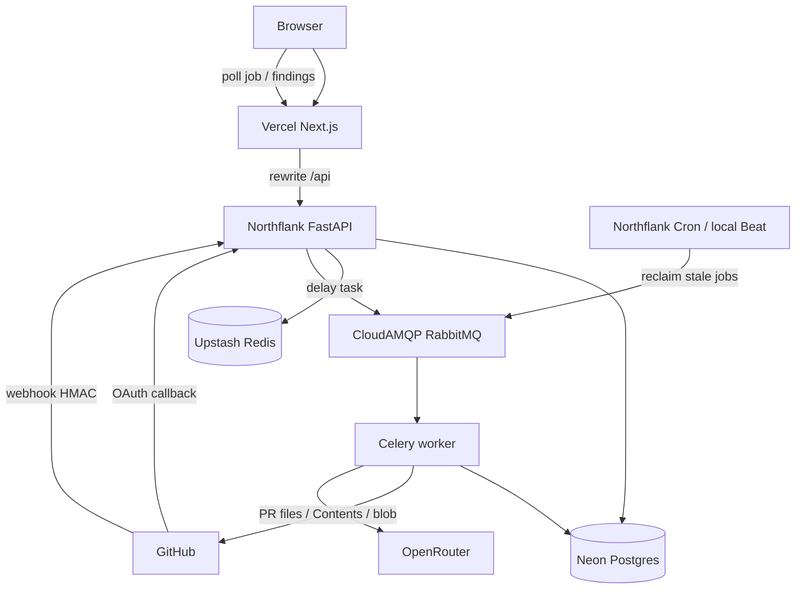

# CodeGuard AI

CodeGuard AI 是一个面向开发者的 AI Code Review SaaS 项目。它的目标不是简单调用大模型生成点评，而是完整实践一个真实工程项目从 GitHub 集成、数据同步、AI review 到后续异步任务和云部署的全流程。

## 系统运行流程

两条入口汇合到同一条 worker pipeline：浏览器手动「Run AI review」，或 GitHub webhook 自动触发。



1. 用户在前端通过 GitHub 登录（httpOnly cookie session），后端保存用户和 token
2. 前端 sync repositories / pull requests / changed files（patch 落库；全文不落库）
3. 手动 `POST /pull-requests/{id}/review-jobs` 创建 job（`pending`，`total_chunks=0`）并入队，返回 `202`
4. 或 GitHub `pull_request` `opened` / `synchronize` webhook 验签后入队，worker 先 sync files 再创建 job
5. Worker 过滤噪声 → 按 `sha` / `contents_url` 拉 PR head 正文 → hunk ±40 行窗口打包 → 每个 pack 打一次 OpenRouter
6. `summary` + `findings` 写入 Postgres；前端轮询 `pending → processing → completed / failed`
7. 满 1 小时整单再跑一次；第二次超时或全部 pack 失败则 `failed`
8. 本地 Beat / 生产 Cron 每 6 小时按 job 的 `updated_at` 回收卡死的 `processing`

重试分三层，不要混在一起：

| 层 | 行为 |
|---|---|
| 单次 OpenRouter 调用 | 空内容 / 5xx 最多再打 3 次**同一段 payload**；超时不上这一层重试 |
| 单个 pack | 失败记进 `error_message`，继续后面的 pack；全部失败才 `failed`。模型窗口超限再拆 pack 是 11A-3，尚未做 |
| 整段 job | Celery soft limit 1 小时后 `self.retry()` **一次**；第二次 `failed` |

## 项目目的

这个项目用于系统学习和展示现代软件工程能力，包括：

- Full Stack 开发
- AI 工程
- GitHub 平台集成
- 异步任务架构
- 数据建模与迁移
- 云原生与后续部署能力

最终目标是把它做成一个可持续迭代、可部署、可写进简历的真实 MVP。

## 技术栈

当前已采用或已规划的主要技术：

- Frontend: Next.js, React, TypeScript, Tailwind CSS, shadcn/ui, TanStack Query, axios, React Hook Form, Zod
- Backend: FastAPI, SQLAlchemy 2, Pydantic, Alembic, httpx
- Database: Neon PostgreSQL
- Cache: Upstash Redis
- GitHub Integration: GitHub App / OAuth, GitHub REST API
- AI Review: OpenRouter API（当前），后续可扩展为更多 provider
- Async / Infra: RabbitMQ（本地 Compose + 生产 CloudAMQP Little Lemur）, Celery Worker；本地 Celery Beat，生产用 Northflank Cron 替代 Beat
- Local Orchestration: Docker Compose（api + worker + beat + rabbitmq）
- Hosting: Vercel Hobby（前端）、Northflank Developer Sandbox（API + worker + cron）
- CI/CD: GitHub Actions（PR 门禁；合入 `main` 后推 GHCR）。Northflank API / worker 从 `ghcr.io/<owner>/repo-guard-backend:main` 部署；前端走 Vercel Git Integration

Architecture 最终完成的流程：GitHub / 浏览器 → FastAPI → RabbitMQ → Celery → OpenRouter → Postgres → 前端轮询。

### 前端技术落地

README 原定前端栈与当前使用情况：

- 已使用：Next.js, React, TypeScript, Tailwind CSS, shadcn/ui（Button / Table / Card）, TanStack Query, axios
- 已安装但未在业务代码中使用：React Hook Form, Zod, lucide-react
- 未使用原因：8C 触发 review 目前是单按钮，尚未做模型选择表单；lucide-react 预留给后续 UI polish（Step 11）


## 当前系统流程

见文首「系统运行流程」。下面路线图按步骤记录实现历史。

## 项目路线图

整个项目可以分为 11 个主要步骤。每一步都对应一个明确的工程目标，而不是为了堆技术而堆技术。Step 1–8 已完成功能闭环；Step 9A–9C 已完成 webhook 自动 review 与两层幂等；9D 评论暂缓；Step 10A–10E 已完成 0 成本部署与 CI/CD（Vercel + Northflank 吃 GHCR `:main` + CloudAMQP）；10F 跳过；Step 11A 已落地忽略噪声、GitHub 窗口打包和 1 小时整单重试，11A-3（模型超限再拆 pack）未做，其余产品化补强随后。

### Step 1: 项目初始化

目的：建立可持续迭代的项目骨架。  
要做的事情：

- 初始化 monorepo
- 建立 `frontend/` 和 `backend/` 基础目录
- 补充根目录 `README`、后续文档和基础规范

状态：已完成

### Step 2: Backend 基础设施

目的：先打通后端基础依赖，让服务具备最小可运行能力。  
要做的事情：

- 搭建 FastAPI 应用
- 连接 Neon PostgreSQL
- 连接 Upstash Redis
- 建立 `/health` 健康检查
- 建立 SQLAlchemy + Alembic 基础迁移能力

状态：已完成

### Step 3: GitHub 身份与数据同步

目的：把 GitHub 用户、仓库、PR 数据同步进本地系统。  
要做的事情：

- GitHub 登录
- 用户落库
- JWT 认证与 `/auth/me`
- 同步 repositories
- 同步 pull requests
- 同步 pull request files / patch

状态：已完成

### Step 4: AI Review 输入准备

目的：把 PR diff 转换为模型可消费的输入。  
要做的事情：

- 建立 `review_jobs` 数据模型
- 建立 diff chunking 逻辑
- 支持小 PR 单请求 review
- 支持大 PR fallback chunking

状态：已完成（运行时路径已由 Step 11A 的窗口打包取代）

### Step 5: AI Review v1

目的：先把一版可运行的 AI review 链路跑通。  
要做的事情：

- 抽象 review provider 接口
- 接入 OpenRouter 在线模型
- 基于 `review_jobs` 执行同步 review
- 将 review summary 回写数据库

状态：已完成基础版本

### Step 6: 结构化 Review Findings

目的：把大段文本 review 结果升级为可展示、可定位、可扩展的数据结构。  
要做的事情：

- 增加 findings 数据表
- 保存 severity、summary、file_path、line range、suggestion
- 让模型输出结构化结果，而不只是纯文本 summary

状态：已完成基础版本

### Step 7: 异步任务系统

目的：把 AI review 从同步接口调用升级为真正后台执行。  
要做的事情：

- 引入 RabbitMQ
- 引入 Celery Worker
- 将 review job 提交到队列
- 支持任务状态轮询、失败重试和错误记录

建议按以下 5 个阶段推进：

#### Phase 7A: RabbitMQ + Celery 最小消息流

目标：先打通消息队列和 worker，不急着修改现有 review API。  
要做的事情：

- 启动 RabbitMQ
- 创建 Celery app
- 编写一个最小任务（如 `hello` / `add`）
- 启动 worker 并验证 `delay()` 后任务能够被消费

状态：已完成

#### Phase 7B: Celery 接入 review job 执行逻辑

目标：让 Celery worker 真正调用 `execute_review_job()`。  
要做的事情：

- 定义 review job task
- task 接收 `review_job_id`
- worker 在后台执行 review
- 结果继续写回 `review_jobs` / `review_findings`

状态：已完成

#### Phase 7C: API 改造为异步任务接口

目标：把创建 review job 的接口改成真正的异步接口。  
要做的事情：

- `POST /pull-requests/{id}/review-jobs` 只负责创建 job
- job 初始状态写为 `pending`
- API 将任务发送到 RabbitMQ
- 立即返回 `202 Accepted`

状态：已完成

#### Phase 7D: 状态轮询与查询规范

目标：让客户端可以通过 job 查询接口获取最新状态。  
要做的事情：

- 明确状态流转：`pending -> processing -> completed / failed`
- 基于 `GET /review-jobs/{id}` 查询状态
- 为前端轮询和后续展示层打基础

状态：已完成

#### Phase 7E: 可靠性与工程化补全

目标：把异步系统从“能跑”升级到“更接近真实工程”。  
要做的事情：

- 增加任务级重试（瞬时 HTTP/网络错误 + 指数退避）
- 增加超时控制（soft/hard time limit；review 任务 1 小时掐断后整单再跑一次）
- 增加日志和错误记录（worker 写回 `review_jobs.error_message`）
- 终态 job 幂等跳过，避免 at-least-once 重复执行
- Celery Beat 自动回收 stale `processing` jobs（本地每 6 小时；按每个 job 的 `updated_at`）
- 本地 `compose.yaml`：api + worker + beat + rabbitmq
- task 层失败路径自动化测试（第一次 soft timeout 整单重试 / 第二次写 `failed` / 重试耗尽 / reclaim）

状态：已完成

Step 7 总状态：已完成 Phase 7A - 7E

### Step 8: Review 展示层

目的：让 review 结果真正可被用户消费。  
要做的事情：

- 前端 GitHub 登录与 session
- 展示 repositories / PRs / files
- 触发 review job，并轮询 `pending / processing / completed / failed`
- 展示 review findings
- 按文件和严重级别过滤
- 提供类似 GitHub review 的阅读体验

建议按以下 4 个阶段推进：

#### Phase 8A: 前端基础与登录

目标：先让浏览器能安全地调用后端。  
要做的事情：

- 后端补 CORS，允许 `frontend_url`
- 打通 GitHub OAuth 回跳到前端并保存 access token
- 建立 API client（axios + TanStack Query）
- 登录页 / 当前用户信息

状态：已完成

#### Phase 8B: Repo / PR 浏览

目标：用户能看到自己的仓库和 PR，而不必每次只靠 curl sync。  
要做的事情：

- 后端补 `GET` 列表接口（当前只有 sync `POST`）
- 前端仓库列表、PR 列表
- 手动 sync 按钮（复用现有 sync API）

状态：已完成

#### Phase 8C: 异步 Review 触发与状态

目标：在 UI 里走完 `202 + 轮询` 这条已存在的后端契约。  
要做的事情：

- 在 PR 详情触发 review job
- 轮询 job 状态
- 展示 `pending / processing / completed / failed` 和 `error_message`

状态：已完成

#### Phase 8D: Findings 阅读体验

目标：让结构化结果真正可消费。  
要做的事情：

- 展示 `result_summary` 与 findings 列表
- 按 `file_path`、`severity` 过滤
- 定位到文件和行号（接近 GitHub review 的阅读方式）

状态：已完成（MVP：点 job 查看 findings，点 finding 进入文件 diff 并滚到行号。左右分栏、行内发评论等产品深度见 Step 11）

Step 8 总状态：已完成 Phase 8A - 8D。展示层功能闭环已通，视觉与安全工程化补强见 Step 11。

### Step 9: GitHub Event-Driven Automation

目的：把 CodeGuard 从「用户主动点 Sync / Run AI review」升级为由 GitHub Pull Request 事件驱动的异步 review 系统。  
原则：**不重构已经工作的 AI pipeline**（Step 3–7 的 sync / `create_review_job` / Celery / OpenRouter）。Webhook 只接到这条链前面。

身份约束（第一轮不做 GitHub App）：

- 现有模型是 GitHub OAuth 用户 token，仓库挂在 `repositories.user_id` 上
- Webhook **没有** JWT / `current_user`
- 用 `payload.repository.id` → `repositories.github_repo_id` → owner 的 OAuth token
- 本地还没有该仓库则记日志并跳过，不在 webhook 里给陌生人建用户

开发环境公网入口（ngrok / Cloudflare Tunnel）只是把 `localhost` 暴露给 GitHub 的工具，**不是**正式架构组件，不要写进业务代码。生产入口属于 Step 10。

状态：9A / 9B / 9C 已完成。9D 暂缓。生产入口已在 Step 10C/10D 落地。

#### Phase 9A: GitHub Webhook（验签 + 过滤，不跑 AI）

目标：GitHub 能把事件送到 CodeGuard，并证明请求真的来自 GitHub。

要做的事情：

- 增加 `POST /webhooks/github`（**不要** `Depends(get_current_user)`）
- 配置 `GITHUB_WEBHOOK_SECRET`；开发时用隧道提供公网 URL
- 用**原始 request body** 校验 `X-Hub-Signature-256`（HMAC SHA-256）；失败返回 401/403
- 只关心 `X-GitHub-Event: pull_request`，第一阶段只**入队处理** `opened` 和 `synchronize`
- 记录 `X-GitHub-Delivery`、event type、action；马上返回 2xx
- `ping` 以及未支持的 action：仍返回 2xx + 打日志，**不**当 4xx（否则 GitHub 设置页显示投递失败）

Webhook **不执行 AI、不等待 Celery、不调用 OpenRouter**。它只做：Verify → Validate →（9B 起才 Dispatch）→ Return。

建议实现顺序：

1. 确认现有 `users` / `repositories` / `pull_requests` 和 GitHub sync service
2. 定 endpoint 职责和文件位置
3. 配 secret 与隧道
4. 实现原始 body + HMAC
5. 过滤 `pull_request` + `opened` / `synchronize`
6. 用 GitHub 测试 webhook（含 ping）

状态：已完成（ngrok 公网 URL + HMAC；`ping` / `opened` / `synchronize` 返回 2xx；`handled` 仅对 `opened`/`synchronize` 为 true）

#### Phase 9B: 自动 Review Pipeline

目标：复用 Step 3–7，把 webhook 接到现有 sync 和 review job。不要再写第二套 webhook-only review service。

流程：

```text
GitHub pull_request
  → HMAC
  → 按 github_repo_id 找本地 repository
  → 取 owner OAuth token
  → 现有 sync PR
  → 现有 sync files / patches
  → 现有 create_review_job
  → Celery.delay(review_job_id)
  → 已有 worker / OpenRouter / findings / 前端轮询
```

说明：

- 同步和建 job 必须在 Celery（或同等队列）里做，不能在 webhook 请求里跑完
- 前端 60s 轮询 job 状态**保留**：Webhook 替代的是「要不要去 GitHub 拉 PR」，不是「浏览器怎么知道 AI 做完了」
- 9B 可以暂时「每次 synchronize 都建 job」；重复 job 的抑制放到 9C

状态：已完成（push 后 worker 自动 `GET .../files`、`create_review_job`、走现有 `execute_review_job`；webhook HTTP 马上 200，不等 OpenRouter。仓库需事先被该用户 Sync 进 CodeGuard）

#### Phase 9C: Reliability & Idempotency

目标：同一投递不处理两遍；连推不刷一串 review job。

两层幂等：

1. **投递幂等**：表 `github_webhook_events`，`UNIQUE(delivery_id)`。同一 `X-GitHub-Delivery` 重放则 ignore。
2. **业务幂等**：该 PR 已有 `pending` / `processing` 的 review job 则 skip，不再 `create_review_job`。
  （不同 delivery 的连续 `synchronize` 单靠 delivery 表挡不住。）

状态：已完成（`github_webhook_events.delivery_id` 唯一约束防止同一 delivery 重放；PR 行锁 + active job 部分唯一索引防止 `pending` / `processing` job 重复创建；手动与 webhook 入口复用同一检查。）

#### Phase 9D: GitHub Comment（可选 / 最后做）

目标：把 findings 汇总评论写回 PR。第一轮不做。

注意：若还订阅了 `issue_comment`，自己的评论可能再打进 webhook 形成环。即使做 9D，也继续只订 `pull_request`，并过滤 bot 自己的事件。

GitHub App / Installation token 不在本步范围，作为以后的 Version 2。

状态：可选，暂缓；当前优先进入 Step 10。

Step 9 总状态：已完成 Phase 9A - 9C。9D 暂缓。生产 webhook / 登录入口见 Step 10C–10D。

### Step 10: 部署与工程化完善

目的：把项目从本地开发原型提升为可部署、可维护的工程系统。  

第一阶段约束：

- 正式业务部署以**严格 0 成本**为目标，不启用会自动产生按量账单的运行资源
- Northflank Developer Sandbox 承载后端运行时（2 Service + 2 Job）；Neon / Upstash / CloudAMQP 保存持久数据和队列，用户数据不落到临时容器磁盘
- Vercel Hobby 仅用于当前个人学习和作品集阶段；未来商业化时升级或迁移
- GCP Free Tier / credit 仅作为隔离的 Terraform、VM、Cloud Run、GKE 练习环境，不接入 CodeGuard 真实数据和生产密钥
- 免费平台没有生产 SLA；代码、镜像、迁移、密钥、CI/CD 和回滚仍按产品级流程建设

第一阶段目标架构：

```text
Browser
  → Vercel Next.js（仅 Production 域名用于登录 / Cookie）
  → 同源 /api rewrite
  → Northflank FastAPI Service
  → CloudAMQP（Little Lemur，AMQPS）
  → Northflank Celery Worker Service
  → OpenRouter
  → Neon PostgreSQL

GitHub webhook
  → Northflank FastAPI `/webhooks/github`（不经过 Vercel）

Northflank Cron Job
  → 每 10 分钟运行 `mark_abandoned_jobs_as_failed`

FastAPI
  → Upstash Redis（分布式限流）
```

#### Phase 10A: Production Baseline

- 加固后端 Dockerfile：非 root 用户、可复现构建、API / worker / migration / cron 复用同一镜像
- 拆分 liveness / readiness；liveness 不访问外部服务，readiness 检查必要依赖
- 增加不含密钥的 `.env.example` 和生产配置校验
- 所有业务持久数据继续写入 Neon；容器磁盘只保存临时文件和受限日志

状态：实现已完成（后端镜像改为非 root 且仅复制运行/迁移文件；增加 `/health/live` 与 `/health/ready`；Redis 故障降级但不触发容器重启；生产环境强制 HTTPS、安全 Cookie 和足够长度的 JWT/Webhook secret；Compose 增加单 worker 并发、健康检查和日志轮转）。自动化测试已通过；Docker 构建需在启用 Docker Desktop WSL integration 后补验。

#### Phase 10B: Upstash Redis Rate Limiting

- Redis 不为了堆技术而缓存数据库数据，第一项真实业务用途是分布式限流
- 对 OAuth、repository / PR / files sync、review job 创建按 IP / user / object 限流
- review 和 sync 写路径在 Redis 不可用时 fail closed；GET 读路径不依赖 Redis
- Webhook delivery 与 review job 幂等继续使用 PostgreSQL，不迁移到 Redis
- Upstash REST Redis 不作为 Celery broker，RabbitMQ 链路保持不变

状态：实现已完成。后端通过 Upstash REST 的单次原子 `EVAL` 执行固定窗口计数；OAuth 按哈希后的客户端 IP 限制为每 10 分钟 20 次，sync 共享每用户 10 分钟 30 次并增加每对象每分钟 6 次，review 限制为每用户每小时 5 次且每个 PR 每 10 分钟 2 次。超限返回 `429 + Retry-After`，Redis 不可用时受保护路径返回 `503`；普通 GET、health、logout、webhook 和 Celery 链路不依赖限流。所有配额均可通过环境变量调整，生产环境强制 `RATE_LIMIT_ENABLED=true`。后端 24 个自动化测试全部通过，并已使用真实 Upstash 验证第一次请求放行、第二次超限和正数重试时间。

本地开发默认可以设置 `RATE_LIMIT_ENABLED=false` 以避免离线环境阻塞写操作。需要联调真实 Upstash 时改为 `true`，并确认 `UPSTASH_REDIS_REST_URL`、`UPSTASH_REDIS_REST_TOKEN` 可用。`RATE_LIMIT_TRUSTED_PROXY_HOPS` 默认是 `1`；Vercel rewrite 已接入，若限流 key 不准，再按实际 `X-Forwarded-For` 链调整，不要盲目加大 hops。

#### Phase 10C: Frontend / Cookie / OAuth

- Vercel 将 `/api/:path*` rewrite 到 Northflank API，浏览器始终使用同源 `/api`
- GitHub OAuth callback 使用 Vercel `/api/auth/github/callback`，再由 rewrite 转发到 FastAPI
- 保持第一方 `httpOnly + Secure + SameSite=Lax` Cookie，避免跨平台域名导致 session 丢失
- GitHub webhook 使用 Northflank API 的稳定公网 URL 直连，不经过 Vercel
- 登录只使用 Vercel Production 域名；Preview 部署每次换主机名，OAuth state Cookie 对不上，会 `Invalid OAuth state`

状态：已完成。前端 `next.config.ts` rewrite `/api/:path*` → `API_ORIGIN`；生产 Cookie 写在 Vercel 域名上。GitHub App 登记 Production callback。Preview URL 不用于登录。

#### Phase 10D: Northflank Runtime

- Service 1：FastAPI API（`nf-compute-10`，公开 HTTP 8000，`/health/live`）
- Service 2：Celery worker，同一镜像，CMD override，`concurrency=1 --without-gossip --without-mingle --without-heartbeat`，不公开端口
- Broker：CloudAMQP Little Lemur（`amqps://`）。Northflank Sandbox 的 RabbitMQ Addon compute plan 全部灰色，无法在 0 成本下启用，因此不占用 Sandbox 的 1 个 Addon 名额
- Cron Job：每 10 分钟运行 `mark_abandoned_jobs_as_failed`，替代占用第三个 Service 的常驻 Celery Beat
- 运行时环境变量注入 Neon、Upstash、OpenRouter、GitHub 和 CloudAMQP；不启用付费扩容、额外 Service、持久卷或超出 Sandbox 的资源

状态：已完成。生产上手动 Run AI review 可走完 `pending → processing → completed`。Cron 已成功执行。GitHub webhook 已改为 Northflank `/webhooks/github`，Redeliver 返回 200。对已 sync 仓库 `git push` 后是否自动出现 review job，仍待补一次手工验证。

#### Phase 10E: CI/CD

- GitHub Actions CI：后端 pytest、Alembic head / migration 检查、前端 lint / typecheck / build、Docker build
- 合并到 `main` 且 CI 全绿后，将后端镜像推到 `ghcr.io/<owner>/repo-guard-backend:<git-sha>` 和 `:main`；PR 不推镜像
- API 与 worker 均为 Northflank Deployment（外部镜像），不再用 Combined 从 Git 构建；镜像路径 `ghcr.io/<owner>/repo-guard-backend:main`
- Sandbox 没有「先迁移再部署」的发布管道。关掉自动更新等于每次发版都手点，所以生产跟 `:main` 自动拉新镜像
- 改表结构：本地对生产 Neon 跑 `alembic upgrade head`，确认完成后再合入 `main`。没有结构变更则直接合入
- 删列 / 删表 / 改列名会让仍在跑的旧进程对着新库摔；日常只加表、加列。Northflank migrate Job 留作备用，不是日常路径
- 前端由 Vercel Git Integration 发布；PR 生成 Preview，`main` 发布 Production
- 不用 Terraform 管理 Northflank Service / Job / Addon

状态：已完成。10F 跳过。11A 打包与超时已落地，下一步是 11A-3。

#### Phase 10F: Observability / Rollback / Zero-Cost Guardrails

状态：跳过。当前全是免费档，排障用 Northflank Logs、GitHub webhook 投递记录和 CloudAMQP 控制台即可。出问题或用量顶满再补，不单独做一阶段。

原计划（未做）：

- API / worker 结构化日志包含 delivery ID、review job ID 和 Celery task ID
- 监控 API 5xx、worker 离线、RabbitMQ 队列堆积、stale job、migration 失败
- API / worker 按 image digest 回滚；应用回滚不自动执行 Alembic downgrade
- GHCR 只保留必要镜像版本；限制日志体积和保留期
- 定期检查 Vercel、Northflank、Neon、Upstash、CloudAMQP/GHCR 的免费额度与政策变化

#### Phase 10G: Isolated GCP Learning Lab

- 使用 GCP credit / Always Free 单独练习 Terraform、VPC、IAM、Compute Engine、Cloud Run 和 GKE
- 不注入 CodeGuard 的 Neon、RabbitMQ、GitHub OAuth、Webhook 或 OpenRouter 生产密钥
- 每个实验设置预算告警和销毁步骤，结束后执行 `terraform destroy`
- Kubernetes / Terraform 学习成果后续再迁移到正式付费生产方案，不把单节点免费环境描述为高可用生产集群

状态：Phase 10A–10E 已完成。10F 跳过。11A 打包与超时已落地，下一步是 11A-3。

### Step 11: 产品化补强（不阻塞 Step 9）

目的：在 Step 8 功能闭环已经可用的前提下，把安全、体验、测试和模型质量补到更接近工业产品。每一条都标明在优化哪一步的哪一点。  
状态：11A 大部分已落地（忽略噪声、GitHub 窗口打包、1 小时整单重试、无 skip 单测）。未做 11A-3（模型报窗口超限再拆这一次请求）。其余产品化项未开始。生产模型是 `openrouter/free`（随机免费模型，上下文窗口未知），按偏小字符预算切分，不按某个固定模型的 token 上限。

#### 11A: Review 输入打包（优先）

针对 Step 6 chunking 和 Step 7B worker 执行。旧 combined / hunk 两档已从运行时移除（git 历史可查）。现在：过滤噪声 → GitHub 窗口 → 贪婪 pack。

硬约束（高于「任务必须 complete」、高于「少打几次 API」）：

- 过滤名单之外、PR 里该审的文件 **一个都不能 skip**。装不进当前 pack 的部分进入 **下一个 pack**，禁止丢掉文件后半段。
- 产出必须有用：切分时要有变更前后的源码上下文。库里只有 GitHub `patch`（hunk 自带约 3 行），不够就用 Contents API / blob `sha` 拉该文件，再取 hunk 附近行。全文只在这次 review 进内存，不写库。
- 生产是 `openrouter/free`，窗口未知；pack 字符预算按 `REVIEW_PACK_MAX_CHARS × 0.6` 预留 prompt/回复空间，不是按某个模型的 token 上限。
- 任务墙钟超时 1 小时（Celery soft limit）。到点重试 **一次**；第二次再超时或失败则标 `failed`。不是靠 skip 文件来换 `completed`。

已落地：

1. **忽略噪声文件**（11A-1）  
   lockfile、`__pycache__`、图片、生成物等不送模型。

2. **取消 combined / chunk 两档，次数不封顶**（11A-2）  
   每个 pack 一次模型请求。没有 `REVIEW_PACK_MAX_CALLS`。装不下就开下一 pack，余量不丢。

3. **单文件超过一个 pack：拉 GitHub 文件，按 hunk 窗口切**（11A-2）  
   用已存的 `sha` / `contents_url` 取 PR head 正文（Contents 403/缺失则走 git blob）。每个变更窗口 = `@@` 行号 ± `REVIEW_CONTEXT_LINES`（默认 40），相邻窗口重叠则合并。  
   窗口仍大于预算 → 按行切开后继续装后续 pack。GitHub 没给 `patch` 的过大文件同样拉全文再切。

4. **模型失败与 1 小时超时**（11A-4）  
   某次 pack 调用失败记进 `error_message`，其余 pack 继续跑；全部失败才 `failed`。  
   Celery `soft_time_limit=3600`，`time_limit=4200`（给写库和 `self.retry()` 留时间）。第一次超时整单再跑，第二次写 `failed`。  
   单次 OpenRouter **超时不重试**；空内容 / 5xx 才对**同一 payload** 最多再打 3 次。  
   `OPENROUTER_READ_TIMEOUT` / `wait_for` 为 7200 秒，大于 soft limit，墙钟掐断只认 Celery。  
   过期 `processing` 回收每 **6 小时** 跑一轮，按 **每个 job 自己的 `updated_at`**；阈值 **10800 秒（3 小时）**。

5. **单测**（11A-5 一部分）  
   噪声过滤、每个业务文件都进某个 pack、大文件余量进后续 pack、窗口带上下文、无 patch 文件仍覆盖、超长单行切开、GitHub raw/403→blob/base64 JSON。

清单：

- [x] **11A-1 忽略噪声文件**
- [x] **11A-2 全覆盖打包 + GitHub 上下文窗口**
- [ ] **11A-3 单次请求超限再拆** — 拆的是这一次 pack 请求（多文件 pack 拆两半，单窗口再缩小上下文半径），不是把文件从队列里拿掉。
- [x] **11A-4 模型失败与 1 小时超时**
- [x] **11A-5 打包单测** — 无 skip / 窗口上下文 / 无 patch。大 PR 集成路径（部分成功、全部失败、模型超限再拆）仍待补，见下方测试计划。

合入 / 上生产前 checklist（环境变量在 **Northflank api + worker**，不是 Neon）：

- Worker CMD：`celery -A app.core.celery_app:celery_app worker -l INFO --concurrency=1 --without-gossip --without-mingle --without-heartbeat`（关掉后才不会空转打满 CloudAMQP 月额度）
- `OPENROUTER_READ_TIMEOUT=7200`
- `CELERY_TASK_SOFT_TIME_LIMIT=3600`
- `CELERY_TASK_TIME_LIMIT=4200`
- `CELERY_TASK_RECLAIM_INTERVAL_SECONDS=21600`
- `REVIEW_JOB_STALE_PROCESSING_SECONDS=10800`
- `REVIEW_PACK_MAX_CHARS=8000`
- `REVIEW_CONTEXT_LINES=40`
- `REVIEW_RETRY_ATTEMPTS=3`（只作用于单次调用的空内容/5xx，不是整单 3 次）
- 去掉 `REVIEW_PACK_MAX_CALLS` 以及旧的 `REVIEW_MAX_COMBINED_*` / `REVIEW_MAX_PATCH_CHARS`
- Cron / Beat 间隔与 `CELERY_TASK_RECLAIM_INTERVAL_SECONDS` 一致（`0 */6 * * *`）
- 这次没有新的 Alembic，不必改 Neon

#### 安全与鉴权

- [ ] **IDOR 自动化测试** — 针对 Step 8 读接口的对象级隔离：用户 B 读取用户 A 的 `GET /review-jobs/{id}`、`GET /pull-requests/{id}/files/{fileId}` 必须 404。当前 join `Repository.user_id` 已经写了，但没有测试锁住。
- [ ] **读路径复检 GitHub 权限** — 针对 Step 3「同步仓库 / PR / files」和 Step 8 的 GET：租户模型目前是「谁 sync 进库」，不是 GitHub ACL。协作者被移出仓库后，库里的 patch / findings 仍可读。
- [ ] **GitHub token 落库加密** — 针对 Step 3「用户落库 / 访问凭证」：`users` 表现在明文存 GitHub access token。
- [ ] **队列与 worker 隔离** — 针对 Step 7B/7C：Celery 按 `review_job_id` 执行和标失败，不校验 user。RabbitMQ 必须保持内网；暴露队列等于可触发任意 review。
- [ ] **Cookie session 加固清单** — 针对 Step 8A「httpOnly cookie session」：核对 SameSite / CSRF、CSP；补按对象的速率限制和审计日志。
- [ ] **资源 ID 策略** — 针对 Step 8D 的 `?jobId=` / `/files/{id}` 以及 Step 3 的自增主键：跨用户已 404，同一账号仍可枚举自己的整数 id。多租户或分享链接前再评估。


#### UI / UX

- [ ] **信息层级与导航** — 针对 Step 8 整体展示层：PR 标题、分支、review 状态应一眼能扫，而不是先翻表。
- [ ] **Job 选中态** — 针对 Step 8C「在 PR 详情展示 job 状态」：当前靠点 `#id` 选中，不够明显。
- [ ] **Findings 与 diff 同屏** — 针对 Step 8D「接近 GitHub review 的阅读方式」：现在要跳到另一页才能看行内评论；可做左右分栏或文件页内嵌列表。
- [ ] **空状态 / 加载 / 密度** — 针对 Step 8B/8C/8D 的列表页：补骨架屏、空状态、失败重试、暗色与基本移动端。
- [ ] **路由级错误与鉴权边界** — 针对 Step 8A–8D：补共享 authenticated layout、`loading.tsx` / `error.tsx` / `not-found.tsx`，统一处理无效 ID、后端 404 和会话失效，避免每个页面重复认证与泛化错误文案。
- [ ] **Review 状态反馈** — 针对 Step 8C：创建 job 后自动选中该 job；文件 diff 页也应刷新活跃 job，避免用户停留在文件页时看不到完成状态。
- [ ] **视觉风格** — 针对 Step 8 展示层：目前是 shadcn 默认件 + 表格，没有品牌和设计 token。可用已安装的 lucide-react 补图标。


#### 可靠性、模型与测试

- [ ] **OpenRouter 空内容 / 非 JSON** — 针对 Step 5「接入 OpenRouter」和 Step 6「结构化输出解析」：免费/路由模型会返回 `content: null` 或 `User Safety: safe`，靠重试才成功。可换具体 chat 模型、加强日志、按模型可选 `response_format`。
- [ ] **单次生成墙钟超时** — 针对 Step 7E「超时控制」：httpx `read` 只限制两次 socket 读的间隔；已用 `asyncio.wait_for` 兜底，需保证 **rebuild worker** 后生效。
- [ ] **前端轮询间隔** — 针对 Step 8C「轮询 job 状态」：当前 `refetchInterval = 60000`，pending/processing 体感偏慢。可缩短，或后续改 SSE/WebSocket。
- [ ] **Chunk / pack 路径集成测试** — 打包单测已有；大 PR、部分成功、全部失败、模型超限再拆（11A-3）仍待补，不再按「固定 hunk 切片」验收。
- [ ] **展示层自动化** — 针对 Step 8C/8D：触发 review、选中 job、过滤 findings、无效 `jobId` 显示 not found，目前只有手工步骤。
- [ ] **API / Webhook 集成测试** — 针对 Step 3、7、9：补 OAuth 鉴权、HMAC/ping、delivery 重放、活跃 job 去重、同步与 review 成功路径测试；当前自动化主要覆盖 Celery task wrapper 的失败路径。
- [ ] **GitHub API 分页** — 针对 Step 3 的 repositories / pull requests / files 同步：当前单次请求最多取 100 条；必须遍历 GitHub `Link` 分页，避免大型账号、仓库或 PR 静默丢数据。
- [ ] **Webhook pipeline 重试与失败追踪** — 针对 Step 9B：为 sync PR/files 和创建 job 的后台任务增加瞬时错误重试、退避、最终失败状态与可观测日志，避免 webhook 已返回 2xx 后任务静默丢失。
- [ ] **Worker 并发执行保护** — 针对 Step 7B/7E：终态 job 已会跳过，但同一 `pending` / `processing` job 仍可能被多个 worker 并发消费；需用数据库原子状态迁移或锁保证同一 job 只有一个执行者。
- [ ] **Review 查询负载拆分** — 针对 Step 8C：job 历史列表不应长期携带所有 findings；列表返回摘要，选中后再请求 `GET /review-jobs/{id}`，避免历史 job 增长后轮询 payload 持续膨胀。
- [ ] **Worker 非 root 运行** — 针对 Step 7E 本地 compose 和 Step 10「Worker 部署方案」：当前 Celery worker 以 root 跑，有 SecurityWarning。
- [ ] **Redis** `/health` **在受限网络下失败** — 针对 Step 2「`/health` 健康检查」：校园网等环境 DNS 拦 `upstash.io` 时健康检查失败；review 主路径并不走 Redis。
- [ ] **配置与迁移工程化** — 针对 Step 2 / Step 10：补不含密钥的 `.env.example`，确保 Alembic autogenerate 导入全部 model，并在 CI 中校验迁移链与 ORM metadata 一致。


#### 产品边界（与 Step 9 的交界，但不替代 webhook）

- [ ] **模型选择表单** — 针对 Step 8C 触发 review：单按钮写死 `openrouter/free`。若要可选模型，再用已安装的 React Hook Form + Zod。
- [ ] **组织 / 多成员** — 针对 Step 3 的「一用户镜像自己的 GitHub」模型：没有 org、没有分享仓库。
- [ ] **评论写回 GitHub** — 即 Step 9D，不在 Step 8 范围；完成 9A–9C 后再做。


## 当前进度

目前已经完成：

- 项目基础初始化
- FastAPI 后端基础结构
- PostgreSQL / Redis 健康检查
- SQLAlchemy + Alembic 数据迁移
- GitHub 登录与用户落库
- JWT 基础认证与 `/auth/me`
- Repository 同步
- Pull Request 同步
- Pull Request files / patch 同步
- Review job 数据模型
- Diff chunking（运行时已改为 GitHub 上下文窗口打包）
- OpenRouter 在线模型调用
- 过滤噪声后按 pack 请求；无 patch 的业务文件仍拉 GitHub 正文覆盖
- Review findings 数据表
- 结构化 review 输出解析
- findings 落库与去重
- pack 失败记错误并继续其余 pack；全部失败才 `failed`
- `GET /review-jobs/{id}` 查询接口
- RabbitMQ + Celery 最小消息流
- Celery worker 后台执行 `execute_review_job()`
- `POST /pull-requests/{id}/review-jobs` 异步化为 `202 Accepted`
- `GET /pull-requests/{id}/review-jobs` 历史任务列表接口
- Celery task 级重试（瞬时错误 + 指数退避）
- Celery soft/hard time limit：满 1 小时整单再跑一次，第二次超时写回 `failed`
- worker 层错误写回 `review_jobs.error_message`（空 `TimeoutError` 会补成可读文案）
- 终态 job 幂等跳过
- Celery Beat / Northflank Cron 每 6 小时回收 stale `processing` jobs（按 job `updated_at`，阈值 3 小时）
- 本地 compose：api + worker + beat + rabbitmq
- task 层失败路径自动化测试
- 后端 CORS + GitHub OAuth 回跳前端 + httpOnly cookie session
- 前端登录 / 当前用户 / 登出
- `GET /repositories`、`GET /repositories/{id}/pull-requests`、`GET /pull-requests/{id}`、`GET /pull-requests/{id}/files`、`GET /pull-requests/{id}/files/{fileId}`
- 前端仓库列表与手动 sync
- 前端 PR 列表与手动 sync
- 前端 PR 详情：Sync files、Run AI review、轮询 job 状态与 `error_message`
- 前端按 job 展示 `result_summary` / findings，支持 severity 与 file 过滤
- 前端文件 diff（行号 + 按 finding 高亮），无效 `jobId` 显示 not found 而不改用其他 job
- Review job / PR file 读接口按 `Repository.user_id` 做对象级隔离（缺 IDOR 自动化测试，见 Step 11）
- `POST /webhooks/github`：原始 body HMAC（`X-Hub-Signature-256`），无 JWT
- 仅将 `pull_request` 的 `opened` / `synchronize` 入队；`ping` 与其它 action 仍 2xx 且不入队
- Celery `process_github_pull_request_webhook`：按 `github_repo_id` 找本地 repo 与 owner OAuth token，复用 sync PR / files / `create_review_job` / `execute_review_job_task`
- `github_webhook_events` + `UNIQUE(delivery_id)`：同一 GitHub delivery 重放只接受一次，重复请求返回 2xx 但不再次入队
- Review job 业务幂等：手动与 webhook 入口统一检查 active job；PR 行锁串行化并发创建，部分唯一索引保证同一 PR 只有一个 `pending` / `processing` job
- 9C 自动化测试：覆盖新 delivery、重复 delivery、broker 发布失败补偿、ping，以及 active job 复用/新建路径
- 开发环境用 ngrok 把 `localhost:8000` 暴露给 GitHub（非架构组件）；生产 webhook 直连 Northflank API
- Vercel Hobby 托管前端；浏览器只请求同源 `/api`，由 rewrite 转到 Northflank FastAPI
- 生产 GitHub OAuth callback 为 Vercel `/api/auth/github/callback`；httpOnly Cookie 落在 Production 域名
- Northflank Sandbox：API Service + Celery worker Service（`nf-compute-10`，GHCR `:main`）+ reclaim Cron Job + 备用 migrate Job
- CloudAMQP Little Lemur 作为生产 RabbitMQ；本地 Compose 仍用容器内 RabbitMQ + Beat

当前已经具备手动与自动两条入口：用户可在浏览器里「登录 → sync → Run AI review → 读 findings」；GitHub webhook 也可入队并走同一条 AI pipeline。9C 已阻止同一 delivery 重放和同一 PR 的活跃 job 重复创建。生产上手动 review 与 webhook Redeliver 已通；push 触发自动 review 仍待补测。对象级 user 隔离已有但尚未用自动化测试锁住；UI 仍是功能向 MVP。

从路线图角度看，当前已经完成 Step 1 到 Step 9C、Step 10A–10E。9D 评论回写暂缓。10F 跳过。11A-1/2/4 与打包单测已落地。下一步是 11A-3（模型超限再拆 pack）。

## 当前核心数据模型

已建立的主要数据表：

- `users`
- `repositories`
- `pull_requests`
- `pull_request_files`
- `review_jobs`
- `review_findings`
- `github_webhook_events`

这些表已经可以支持 GitHub 数据同步、结构化 AI review 和 findings 存储流程。

## 下一步计划

GitHub webhook 自动 review、9C 两层幂等，以及 10A–10E 的 0 成本部署和 CI/CD 已经完成。10F 跳过。11A 打包与 1 小时整单重试已落地。按优先级推进：

1. Step 11A-3：模型报窗口超限时拆的是这一次 pack 请求，不能把文件从队列拿掉
2. 补测：对已 sync 仓库 `git push` 后，生产 webhook 是否自动创建并完成 review job
3. Step 11 其余：安全测试、UI polish、模型质量
4. Step 9D（可选、暂缓）：findings 写回 GitHub PR 评论

## 项目状态

当前项目已完成 GitHub 集成、结构化 AI review、异步任务、前端展示、webhook 驱动的自动 review、delivery/active job 两层幂等，以及 Vercel + Northflank + CloudAMQP 的 0 成本部署。9D GitHub 评论回写暂缓。10E：合入 `main` 推 GHCR，API / worker 跟 `:main`。改表则本地先对生产 Neon 迁移再合入。10F 跳过。11A 打包与 1 小时整单重试已落地；下一步 11A-3。上线 worker 必须改超时 / packing 环境变量，并加上 `--without-gossip --without-mingle --without-heartbeat`。

## 当前阶段测试计划

Step 7E 的 task 层失败路径和 Step 9C 的核心幂等路径已经用自动化测试锁住。Step 8 展示层目前以手工验证为主。结构化 review 在不同输入规模下的稳定性测试，以及 IDOR 测试，已记入 Step 11。

已完成验证：

- 小 PR 可走打包 review（能装进一个 pack 时 `total_chunks` 在执行后为 1；创建时为 0）
- `summary` 与 `findings` 可成功解析
- `summary` 与 `findings` 可成功写入数据库
- `review_jobs` 接口能够返回结构化结果
- compose 可启动 api / worker / beat / rabbitmq
- task 层第一次 soft timeout 会整单重试，不写 `failed`
- task 层第二次 soft timeout 会写回 `failed`
- task 层瞬时错误重试耗尽会写回 `failed`
- Beat reclaim task 会调用回收逻辑
- 前端 GitHub 登录 / 登出 / session 保持
- 前端仓库列表与 PR 列表，刷新走 GET 而不自动 sync GitHub
- 前端 PR 详情可触发 review 并轮询 `pending / processing / completed / failed`
- 点 review job 可展示该 job 的 summary 与 findings，过滤后列表会变
- 点 finding 可进入对应文件 diff 并定位行号；无效 `jobId` 显示 not found
- GitHub webhook HMAC 验签：错误签名 401；`ping` 与 `pull_request.synchronize` 返回 200
- 生产 webhook 改为 Northflank 公网 URL 后，GitHub Redeliver 返回 200
- 生产环境手动 Run AI review 可完成；Cron reclaim Job 可成功执行
- 本地：push 到已 sync 仓库的 PR 后，不点 Run AI review 也会自动出现 review job 并可以 `completed`（生产 push 路径待补测）
- 相同 `delivery_id` 重放返回 2xx 且不重复 dispatch；broker 发布失败会删除 delivery 记录以允许 GitHub 重试
- 同一 PR 已有 `pending` / `processing` job 时，手动与 webhook 入口复用已有 job，不重复创建或入队
- 噪声文件不进入 pack；无 patch 的业务文件仍生成窗口；大文件余量进入后续 pack
- 当前后端自动化测试共 37 个

仍建议补完的测试（Step 11A-3 / 集成路径，不阻塞已落地的打包）：

1. 小 PR 成功路径测试
  - 条件：过滤后的输入能装进一个 pack
  - 预期：`total_chunks = 1`
  - 预期：`status = completed`
  - 预期：`result_summary` 不为空
  - 预期：`findings` 可正常入库并随接口返回
2. 大 PR 打包路径测试
  - 条件：过滤噪声后仍超过一个 pack
  - 预期：`total_chunks` 等于 pack 次数（不是 hunk 数）
  - 预期：每个该审文件都出现在某个 pack 里
  - 预期：成功 pack 的 `summary` 会拼接进 `result_summary`
  - 预期：成功 pack 的 `findings` 会写入数据库
3. pack 超限再拆测试（11A-3，未实现）
  - 条件：人为返回上下文超限
  - 预期：把该 pack 拆开再请求，而不是对同一输入连打 3 次
  - 预期：拆后仍失败则记错误并继续后续 pack，不把文件当 skip
4. 部分成功测试
  - 条件：部分 pack 成功，部分失败
  - 预期：整个 review job 仍可 `completed`
  - 预期：`error_message` 中包含失败信息
  - 预期：数据库中保留成功 pack 产出的 findings
5. 全部 pack 失败测试
  - 条件：所有 pack 都失败
  - 预期：整个 review job 标记为 `failed`
  - 预期：`error_message` 中包含失败原因汇总
6. 去重、路径补全与忽略名单测试
  - 条件：lockfile 等噪声文件在 diff 里；不同 pack 产出重复 findings，或 finding 缺少 `file_path`
  - 预期：噪声文件不进入任何 pack
  - 预期：重复 findings 会被去重
  - 预期：pack 内缺失的 `file_path` 会被 fallback 补齐

这些测试对应 Step 11A。打包单测已覆盖无 skip / 上下文 / 无 patch；展示层已可消费已稳定的小 PR 成功路径。

Test command

联调整套后端（推荐）：

```
cd backend
docker compose up -d --build
```

开发迭代 API 时，可只起队列相关进程，本机热重载：

```
docker compose up -d rabbitmq worker beat
source venv/bin/activate
uvicorn app.main:app --reload
```

跑 7E task 层测试：

```
cd backend
source venv/bin/activate
pytest -q
```

source into environment: 

```
source venv/bin/activate
```

start backend (without compose api): 

```
uvicorn app.main:app --reload
```

start rabbitmq: 

```
docker compose up -d rabbitmq
```

start celery worker: 

```
celery -A app.core.celery_app:celery_app worker -l INFO --concurrency=1 --without-gossip --without-mingle --without-heartbeat
```

start celery beat: 

```
celery -A app.core.celery_app:celery_app beat -l INFO --schedule=/tmp/celerybeat-schedule
```

verify current user: 

```
curl http://localhost:8000/auth/me \
  -H "Authorization: Bearer YOUR_ACCESS_TOKEN"
```

sync REPO:

```
curl -X POST http://localhost:8000/repositories/sync \
  -H "Authorization: Bearer YOUR_ACCESS_TOKEN"
```

sync PR for [REPO_ID]:

```
curl -X POST http://localhost:8000/repositories/REPO_ID/pr/sync \
  -H "Authorization: Bearer YOUR_ACCESS_TOKEN"
```

sync PR files for [PR_ID]:

```
curl -X POST http://localhost:8000/pull-requests/PR_ID/files/sync \
  -H "Authorization: Bearer YOUR_ACCESS_TOKEN"
```

create review job:

```
curl -X POST http://localhost:8000/pull-requests/PR_ID/review-jobs \
  -H "Authorization: Bearer YOUR_ACCESS_TOKEN" \
  -H "Content-Type: application/json" \
  -d '{
    "provider": "openrouter",
    "model_name": "openrouter/free"
  }'
```

verify all review jobs for [PR_ID]:

```
curl "http://localhost:8000/pull-requests/3/review-jobs" \
  -H "Authorization: Bearer <token>"
```

polling status of single review job:

```
curl "http://localhost:8000/review-jobs/<job_id>" \
  -H "Authorization: Bearer <token>"
```
